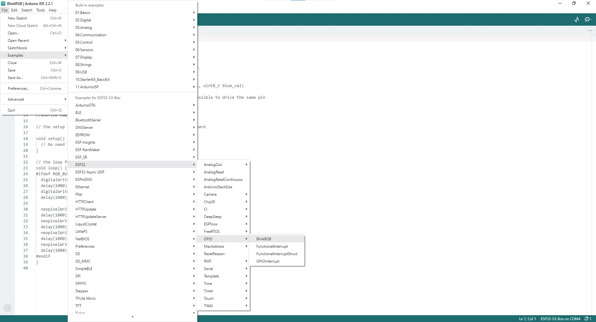

Now that we've installed the espressif boards package in Arduino, it's time to upload our first sketch to make sure everything is working properly.

## Blink RGB Example

The ESP32 core includes integrated code support for easily controlling a WS2812 LED and an example demonstrating how to cycle an RGB LED like the one found on this Thing Plus so long as the board variant defines it as `RGB_BUILTIN`. The Thing Plus ESP32-C6 does define IO23 as `RBG_BUILTIN` so this example and all other code calling for the built-in RGB LED works for this board. Open the example by navigating to **File** > **Examples** > **ESP32** > **GPIO** > **BlinkRGB** like the screenshot below shows: 

<figure markdown>
[{ width="600"}](./assets/img/BlinkRGB_example.jpg "Click to enlarge.")
</figure>

Select the board (SparkFun ESP32-C6 Qwiic Pocket or ESP32-C6 Dev Module until the Thing Plus is added to the espressif boards package) and Port and click "Upload". After uploading you should see the STAT LED on the board turn on full white, turn off, and then cycle through red, green, and blue repeatedly.

!!! note "USB CDC On Boot Settings"

    Take note of the option labeled "USB CDC on Boot" when selecting the Board from the Tools menu. This option sets the serial outputs and defines their label for use in code. The SparkFun variants default to Enable USB CDC on boot which sets both <code>Serial</code> and <code>Serial0</code> as available serial ports. In this configuration, <code>Serial</code> corresponds to the direct USB/Serial converter on the chip (and the USB-C interface) and <code>Serial0</code> corresponds to the UART0 bus (default pins are 16 and 17).

    With either setting, <code>Serial1</code> is available and refers to the UART1 bus (default pins are 4 and 5).