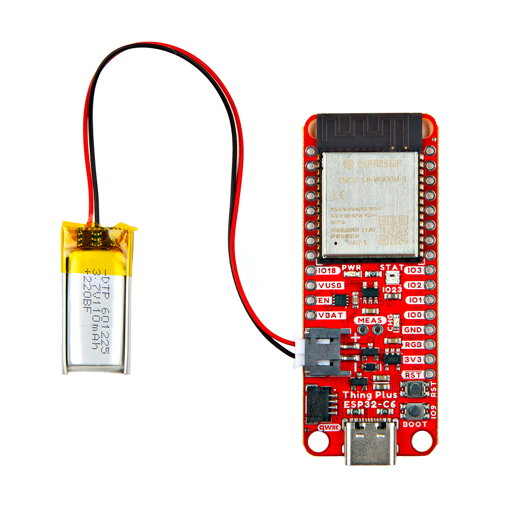

Now that we're familiar with the hardware on this Thing Plus board, it's time to connect it to our computer or battery power.

## Basic USB Assembly

Basic assembly of the Thing Plus ESP32-C only requires a USB-C cable connecting the board to a computer. Just plug the cable into the USB-C connector like the photo below shows and move on to the Software Setup section. 

<figure markdown>
[{ width="600"}](./assets/img/Thing_Plus_C6-USB_Assembly.jpg "Click to enlarge")    
</figure>

!!! note
    Your computer may not recognize the board as a known USB device if you have not installed the espressif boards package in Arduino and/or installed the espressif IDF.

## Battery Assembly

If you prefer a battery-powered application, plug a single-cell LiPo battery into the 2-pin JST connector on the underside of the board like the photo below. Remember, the MCP73831 only charges the battery when V_USB has voltage present either from the USB-C connector or through the V_USB PTH pin.

<figure markdown>
[{ width="600"}](./assets/img/Thing_Plus_C6-Battery_Assembly.jpg "Click to enlarge")
</figure>

For tips on the proper use of a LiPo battery and the 2-pin JST connector, please read through our [Single Cell LiPo Battery Care](https://learn.sparkfun.com/tutorials/single-cell-lipo-battery-care) tutorial.