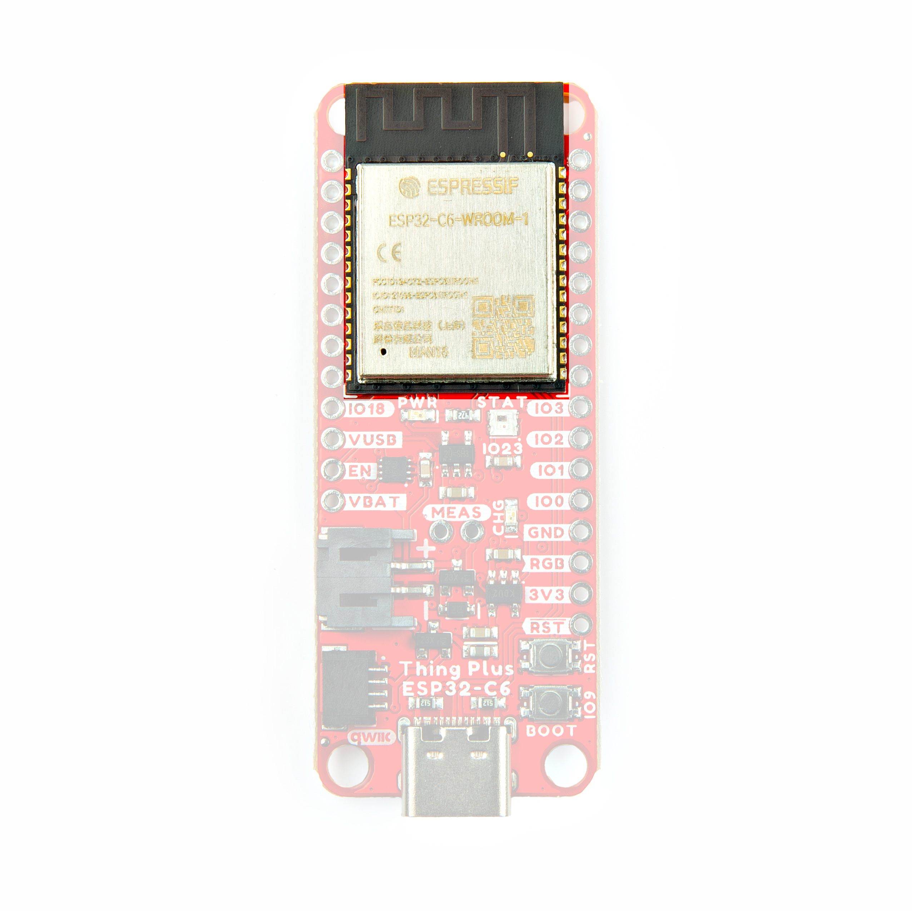
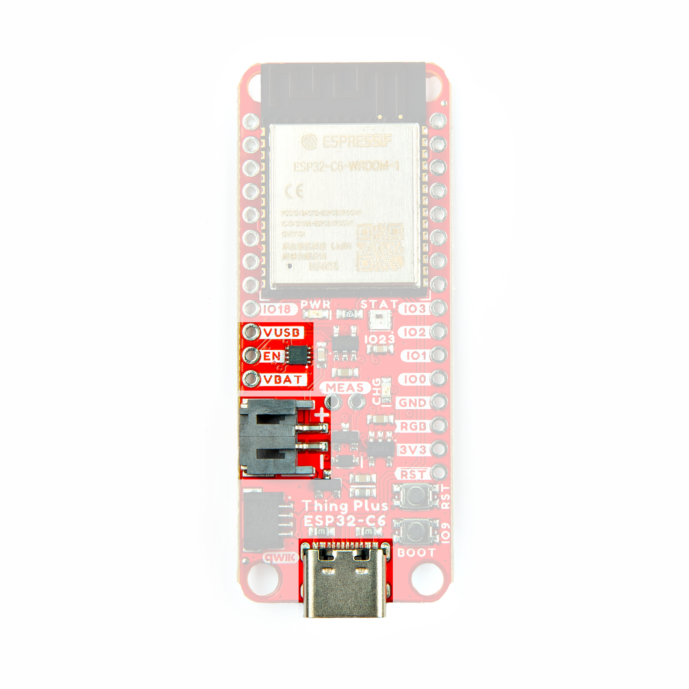
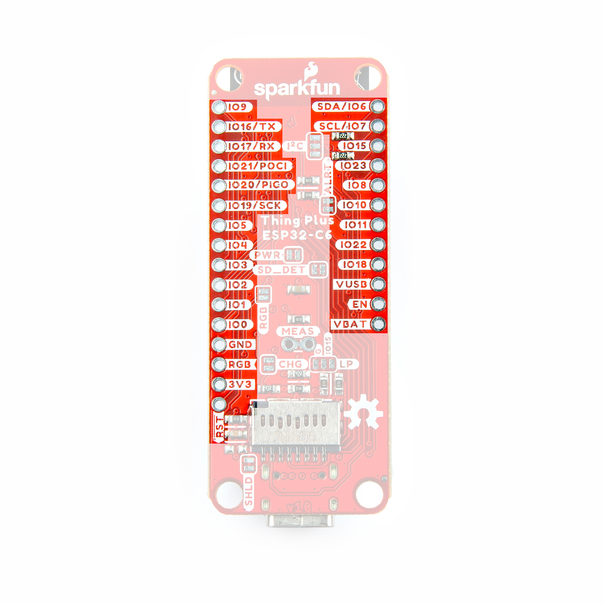
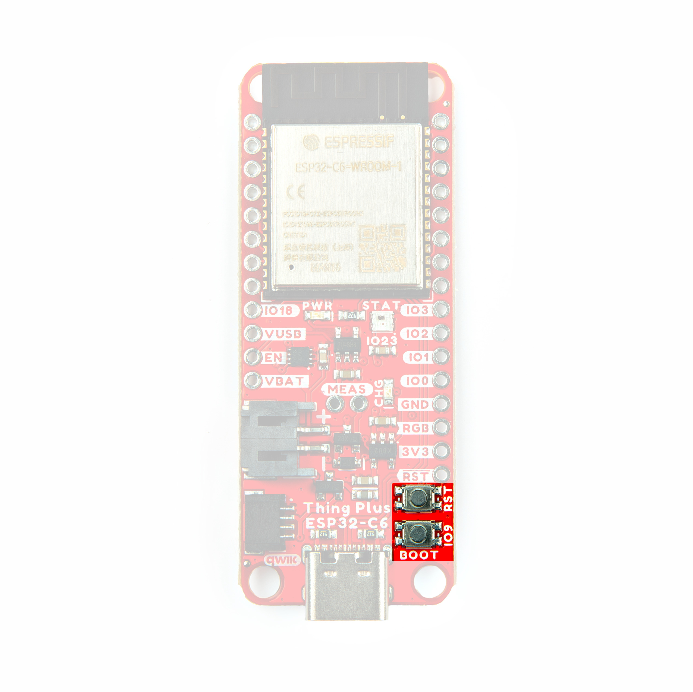
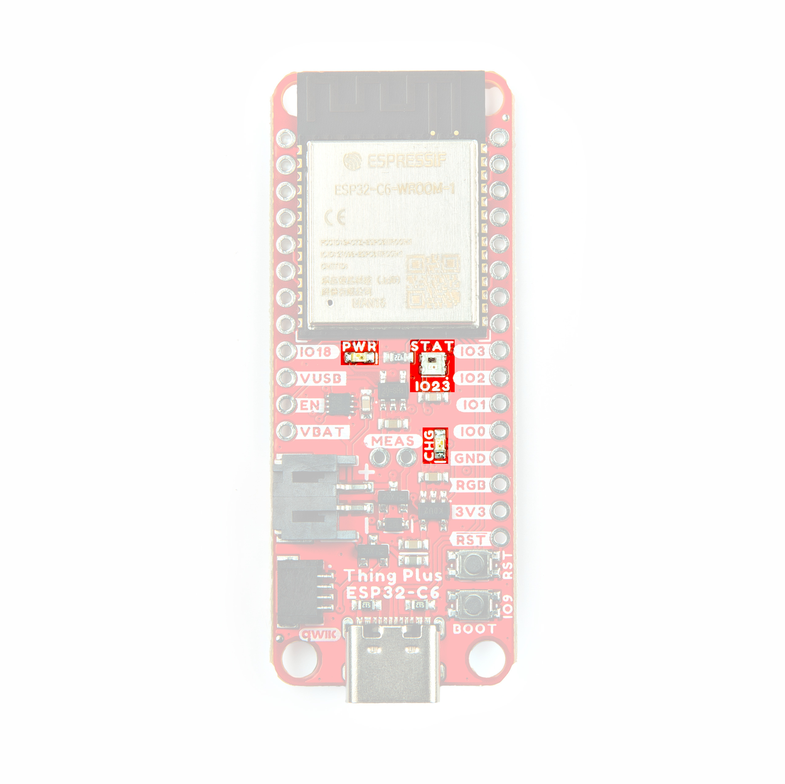
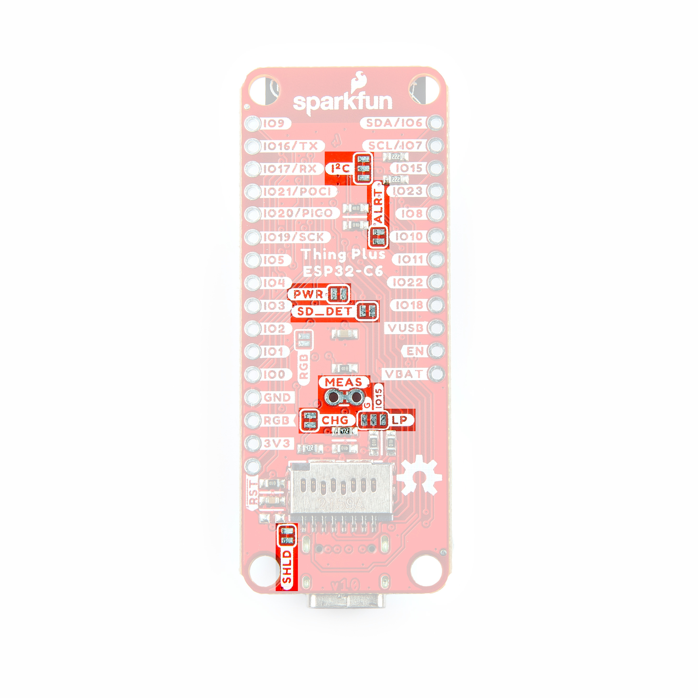

Let's take a closer look at the ESP32-C6 WROOM1 module and other hardware present on this Thing Plus board.

## ESP32-C6 WROOM1 Module

The ESP32-C6 WROOM1 module from espressif combines a powerful RISC-5 processor with a wireless stack compatible with most common wireless protocols.

<figure markdown>
[{ width="600"}](./assets/ "Click to enlarge")
</figure>

This development board uses the WROOM1 version of the C6 module which has slightly more computing power in exchange for lesser power efficiency. The ESP32-C6 features a 32-bit RISC-V single-core processor with an integrated wireless stack. The wireless stack is compatible with 2.4 GHz WiFi 6, Bluetooth&reg; 5.3, Zigbee and Thread (802.15.4) and uses an on-board PCB antenna. 

The module features a wide range of peripheral options including SPI, UART, LPUART, I2C, I2S, LED PWM, USB Serial/JTAG controller, ADC and more. Many of these peripherals can be mapped to any GPIO pin though some are tied to specific pins. This Thing Plus breaks out 21 pins from the module to a pair of 0.1"-spaced PTH headers.

The ESP32-C6 has 16 MB Flash memory along with 512 KB SRAM (high power)/ 16 KB SRAM (low power). The module uses pin strapping to configure boot mode parameters. The board defaults to standard mode (GPIO 9 internal pull-up, all other strapping pins floating) but it can be set to other parameters by performing the following pin strapping:

    * SDIO Sampling and Driving Clock Edge - MTMS & MTDI
    * Chip Boot Mode - GPIO8 & GPIO9
    * ROM Code Printing to UART - GPIO8
    * JTAG Signal Source - GPIO15

## Power Components

The Thing Plus ESP32-C6 includes several options for powering including USB-C, LiPo battery with on-board battery charging and monitoring circuits as well as direct power inputs.

<figure markdown>
[{ width="600"}](./assets/ "Click to enlarge")
</figure>

### USB-C Connector

The USB-C connector on the board acts as the primary serial interface for the ESP32-C6 module as well as a power input. It connects directly to the ESP32-C6's USB serial converter. The <b>5V</b> USB input voltage is regulated down to <b>3.3V</b> through a voltage regulator with a max current of <b>500mA@3.3V</b>.

### 2-JST Connector, Battery Charger, & Fuel Gauge

The board has a 2-pin JST connector to connect a single-cell Lithium Ion (LiPo) battery for battery-powered applications. It also has an MCP73831 battery charger to charge an attached battery and a MAX17048 fuel gauge to monitor battery voltage levels. The charge rate is set to <b>214mA@3.3V</b>. The MCP73831 receives power from the V_USB line so it only is powered when <b>5V</b> is provided either over USB or the V_USB PTH pin. If applying voltage directly to the V_USB pin make sure it does not exceed <b>5.5V</b>.

## Pinout & Qwiic Connector

<figure markdown>
[{ width="600"}](./assets/ "Click to enlarge")
</figure>

### PTH Headers

The Thing Plus routes 23 of the ESP32-C6's GPIO pins to a pair of 0.1"-spaced headers on either side of the board. This includes all seven of the 12-bit ADC-capable pins, one UART, one I2C bus (SDA/SCL), one SPI interface (POCI/PICO/SCK), and seven GPIO pins. Some of the GPIO connect to specific functions on the board by default through solder jumpers listed below:

    * IO18 - CS
    * IO22 - SD Detect
    * IO11 - MAX17038 Alert
    * IO23 - WS2812 STAT LED Data In
    * IO15 - Low Power control

### Qwiic Connector

There's a Qwiic connector on the board tied to the ESP32-C6's Low Power I2C bus (I/O pins 6 and 7) for easy integration into SparkFun's Qwiic ecosystem. The Qwiic connector provides connections for SDA, SCL, 3.3V, and Ground.

## Buttons

There are two buttons on the board labeled <b>RESET</b> and <b>BOOT</b>. The RESET button is tied to the ESP32-C6's Enable (EN) pin and resets the module when pressed. The BOOT button puts the ESP32-C6 into bootloader mode when held down during power on or reset.

<figure markdown>
[{ width="600"}](./assets/ "Click to enlarge")
</figure>

## LEDs

This Thing Plus has three LEDs labeled <b>PWR</b>, <b>CHG</b>, and <b>STAT</b>. The red Power (PWR) LED indicates whenever the <b>3.3V</b> circuit is powered. The yellow Charge (CHG) LED indicates whenever the MCP73831 is charging a connected LiPo battery. The WS2812 RGB Status (STAT) LED connects the LED's Data In signal to IO23.

<figure markdown>
[{ width="600"}](./assets/ "Click to enlarge")
</figure>

## Solder Jumpers

There are nine solder jumpers on the Thing Plus - ESP32-C6 labeled <b>I2C</b>, <b>ALRT</b>, <b>SD_DET</b>, <b>MEAS</b>, <b>LP</b>, <b>SHLD</b>, <b>RGB</b>, <b>CHG</b>, and <b>PWR</b>. The table below outlines the jumpers' labels, default state, function, and any notes regarding their use:

<figure markdown>
[{ width="600"}](./assets/ "Click to enlarge")
</figure>

<table>
    <tr>
        <th>Label</th>
        <th>Default State</th>
        <th>Function</th>
        <th>Notes</th>
    </tr>
    <tr>
        <td>I2C</td>
        <td>CLOSED</td>
        <td>Three-way jumper pulls the SDA/SCL lines to <b>3.3V</b> through a pair of <b>2.2k&ohm;</b> resistors</td>
        <td>Open completely to disable pullups on I2C bus if needed</td>
    </tr>
    <tr>
        <td>ALRT</td>
        <td>CLOSED</td>
        <td>Ties the MAX17048's alert pin to IO11 for battery voltage monitoring</td>
        <td>Open to isolate IO11 from the MAX17048's alert pin</td>
    <tr>
        <td>SD_DET</td>
        <td>CLOSED</td>
        <td>Connects the &micro;SD card's card detection pin to IO19</td>
        <td></td>
    </tr>
    <tr>
        <td>MEAS</td>
        <td>CLOSED</td>
        <td>Completes the input voltage circuit from V_USB & V_Batt to the 3.3V regulator</td>
        <td>Open to interrupt the circuit to measure current consumed by the board with a [digital multimeter](https://learn.sparkfun.com/tutorials/how-to-use-a-multimeter#measuring-current)</td>
    </tr>
    <tr>
        <td>LP</td>
        <td>See Note</td>
        <td>Enables/disables low power control for the ESP32-C6</td>
        <td>Three-way jumper. Defaults to disabled (connects to Ground). Adjust to IO15 side to enable low power control</td>
    </tr>
    <tr>
        <td>SHLD</td>
        <td>CLOSED</td>
        <td>Ties the USB-C shield pin to the ground plane</td>
        <td>Open to isolate USB-C shield pin from the board's ground plane</td>
    </tr>
    <tr>
        <td>RGB</td>
        <td>Open</td>
        <td>Connects WS2812 data out (DO) signal to the No Connect/AREF PTH pin</td>
        <td>Open to isolate DO signal from the No Connect/AREF PTH pin to chain with other WS2812 LEDs</td>
    </tr>
    <tr>
        <td>CHG</td>
        <td>CLOSED</td>
        <td>Completes Charge LED circuit</td>
        <td>Open to disable Charge LED</td>
    </tr>
    <tr>
        <td>PWR</td>
        <td>CLOSED</td>
        <td>Completes the Power LED circuit</td>
        <td>Open to disable the Power LED</td>
    </tr>
</table>

## Board Dimensions

This board matches the Thing Plus footprint and measures 2.30" x 0.90" (58.42mm x 22.86mm) with four mounting holes that fit a [4-40 screw](https://www.sparkfun.com/products/10453).

<figure markdown>
[{ width="600"}](./assets/board_files/Thing_Plus_ESP32_C6-Dimensions.png "Click to enlarge")
</figure>